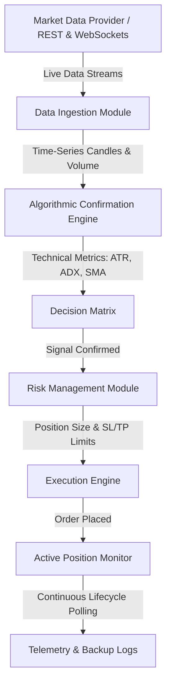

# Algorithum

**Algorithum** is a high-performance, real-time algorithmic execution and data analysis system written in Python. It is designed to ingest live asset streams, calculate statistical momentum metrics, evaluate complex entry/exit signals through a rule-based confirmation engine, and execute automated transaction instructions with robust risk management controls.

The system is engineered to run continuously on a cloud infrastructure (VPS) with automated daemon management and state verification.

---

## Key Features

- **Real-Time Data Ingestion & Analysis:** Integrates high-throughput API endpoints to fetch live asset prices, order-book spreads, and volume profiles with low latency.
- **Multifaceted Confirmation Engine:** Implements structural analysis algorithms to detect market trends, swings, volume breakouts, and consolidation phases.
- **Adaptive Risk Management:** Dynamically calculates optimal entry points, position sizing, slippage limits, and stop-loss/take-profit thresholds to mitigate downside risk.
- **Resilient VPS Deployment:** Configured with robust automation scripts for process monitoring, background daemonization (via Unix screen/nohup), status reports, and auto-recovery.
- **Structured Telemetry & Auditing:** Features thread-safe execution logs, error tracking, and custom metrics backup for seamless auditability.

---

## System Architecture



---

## Technical Details

### Analytical Modules
- **Average True Range (ATR) & Volatility Calculation:** Monitors asset price ranges over custom periods to establish dynamic stop-loss levels based on market volatility.
- **Breakout & Swing Recognition:** Evaluates consecutive movement thresholds, swing highs/lows, and volume ratios to verify momentum validity before executing entry signals.
- **Spread & Slippage Protection:** Restricts executions when the bid-ask spread or expected slippage exceeds strict configurable tolerance parameters.

---

## Project Structure

```
├── main.py                 # System entrypoint and daemon run loop
├── strategy.py             # Algorithmic criteria and pre-execution routing
├── confirmation.py         # Multi-tiered validation rules for entry/exit
├── trade_manager.py        # Order sizing, execution, and lifecycle tracking
├── exchange_manager.py     # Interface for real-time market data retrieval
├── config.py               # Configurable parameters (Risk levels, intervals)
├── deploy_all.sh           # Main VPS deployment orchestration script
└── .gitignore              # Specifies files to exclude from version control
```

